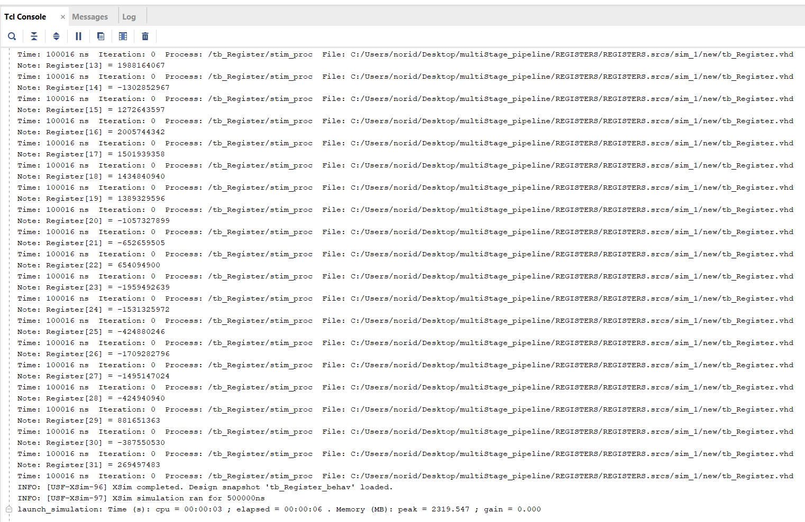
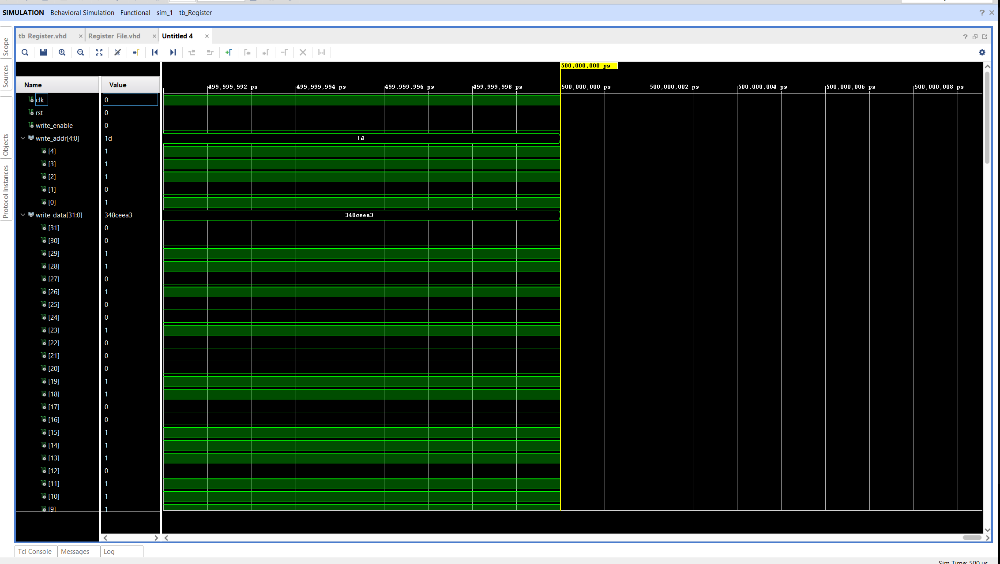
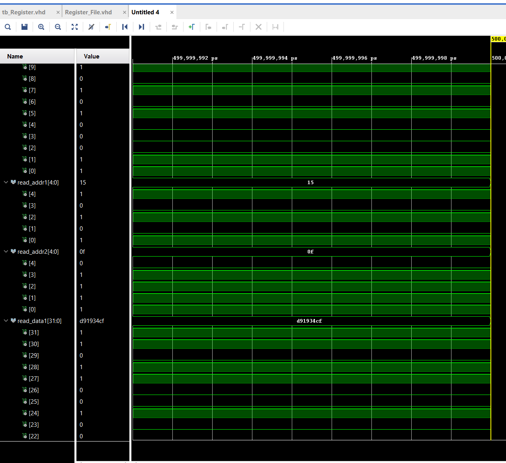
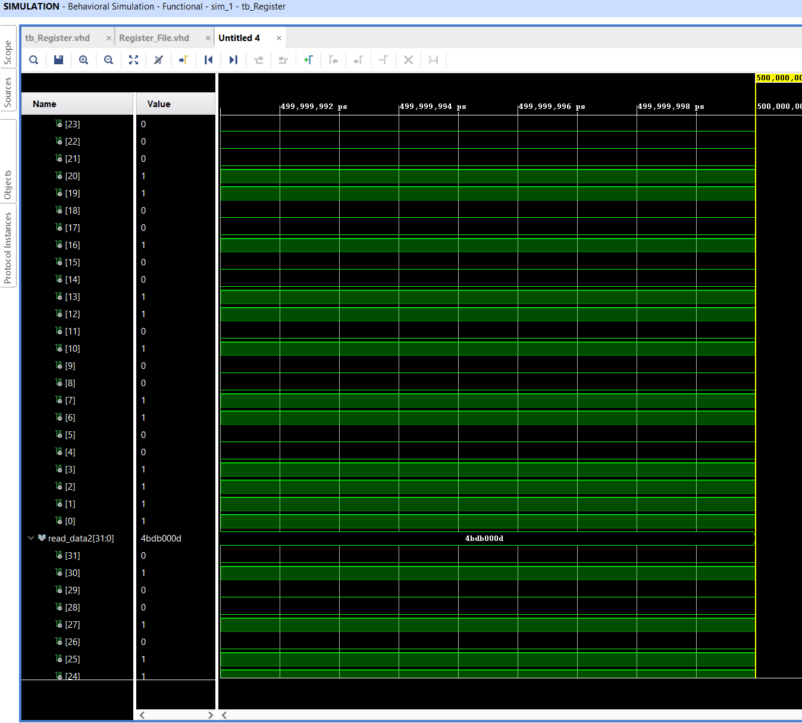
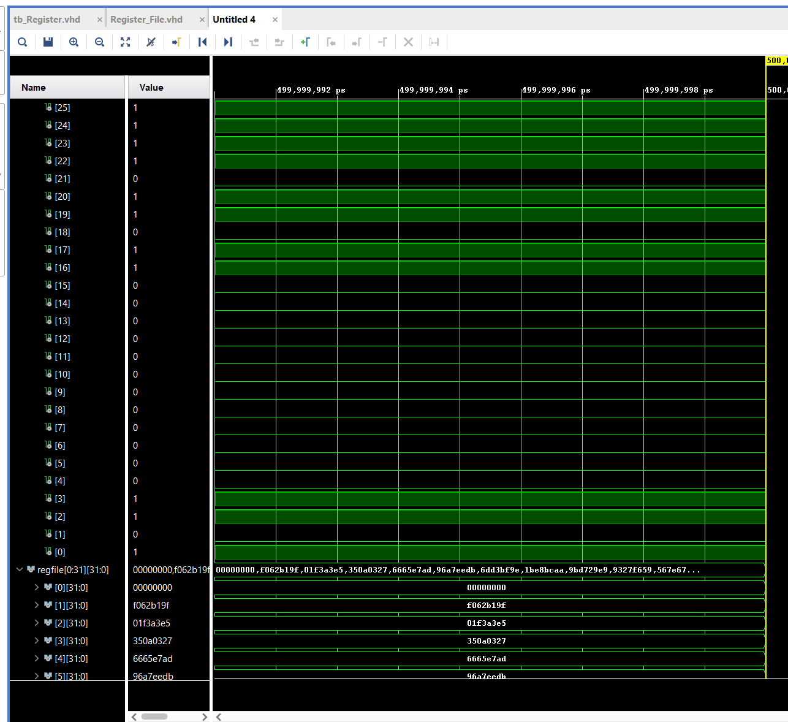
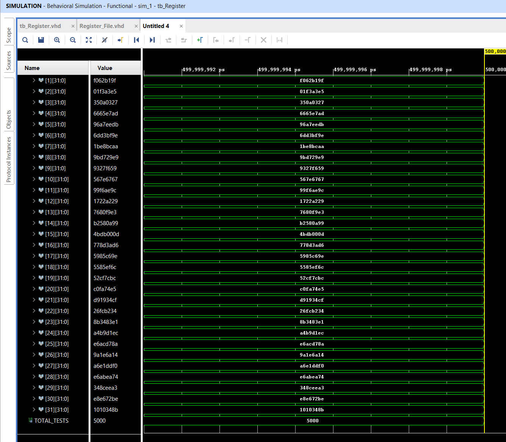

# 32x32-bit Register File in VHDL
Designed and implemented a 32-register file (32-bit width each) in VHDL for a custom CPU. The module supports dual-read and single-write ports with synchronous write and asynchronous read operations. Register x0 is hardwired to zero, rejecting all write attempts per RISC-V convention. A synchronous reset clears all registers to zero. Verified functionality using a randomized testbench that dynamically generated write/read sequences, including edge cases like x0 write protection and reset behavior.

## Project Structure
32x32-bit-Register-File-in-VHDL/
├── images/
│   ├── REG_TCL_1.png
│   ├── REG_TCL_2.png
│   ├── reg_wave_1.png
│   ├── reg_wave_2.png
│   ├── reg_wave_3.png
│   ├── reg_wave_4.png
│   ├── reg_wave_5.png
├── src/
│   ├── Register_File.vhd
├── test_bench/
│   ├── tb_Register/
├── .gitignore/
├── README.md/

## Testbench Strategy

The register file was tested using a randomized VHDL testbench that simulates realistic and edge-case scenarios. The testbench performs the following:

- Generates random write addresses, data values, and control signals each cycle
- Randomly selects read addresses and compares output with expected results
- Ensures register x0 always reads as zero and ignores write attempts
- Verifies correct behavior after reset (all registers return to 0)
- Tracks write history to assert correctness of future read operations

By randomizing inputs and monitoring output correctness across many cycles, this strategy uncovers unexpected behavior and validates robustness beyond fixed test cases.

## Key Learnings

- Understood the importance of enforcing architectural constraints (e.g., hardwired x0 register like in RISC-V)
- Learned how to design and implement asynchronous read and synchronous write behavior
- Learned to safeguard hardware designs using randomized testbenches that auto-generate inputs and validate results to catch edge cases missed by manual tests
- Improved debugging skills using TCL scripts to control simulation runs and automate waveform inspection
- Reinforced knowledge of CPU register file operation

## Simulation Results

**5000/5000** randomized test cases passed

### Tcl Console Output
This shows the final test summary from the randomized testbench:

### Waveform Example
Captured waveform for a successful OR operation showing `result`, control signals, and flags:

## How to Run

1. Launch **Vivado 2024.2**
2. Open the project or create a new one and add the files from the `src/` and `test_bench/` folder.
3. Set `tb_Register.vhd` as the top simulation unit
4. Click **Simulation → Simulation Settings**. Then, under **Simulation → xsim.simulate.runtime**, increase the runtime to accommodate all randomized test cases.
5. Open the **Waveform Viewer** to inspect signal transitions
6. View the test results in the **Tcl Console**

## Author
**Noridel Herron**  
Senior Computer Engineering Student @ MIZZOU
noridel.herron@gmail.com

## Disclaimer

This project is developed solely for educational and personal learning purposes.  
It may contain unfinished or experimental features and is not intended for commercial or production use.

## MIT License

Copyright (c) 2025 Noridel Herron

Permission is hereby granted, free of charge, to any person obtaining a copy
of this software and associated documentation files (the "Software"), to deal
in the Software without restriction, including without limitation the rights
to use, copy, modify, merge, publish, distribute, sublicense, and/or sell
copies of the Software, and to permit persons to whom the Software is
furnished to do so, subject to the following conditions:

The above copyright notice and this permission notice shall be included in
all copies or substantial portions of the Software.

THE SOFTWARE IS PROVIDED "AS IS", WITHOUT WARRANTY OF ANY KIND, EXPRESS OR
IMPLIED, INCLUDING BUT NOT LIMITED TO THE WARRANTIES OF MERCHANTABILITY,
FITNESS FOR A PARTICULAR PURPOSE AND NONINFRINGEMENT. IN NO EVENT SHALL THE
AUTHORS OR COPYRIGHT HOLDERS BE LIABLE FOR ANY CLAIM, DAMAGES OR OTHER
LIABILITY, WHETHER IN AN ACTION OF CONTRACT, TORT OR OTHERWISE, ARISING FROM,
OUT OF OR IN CONNECTION WITH THE SOFTWARE OR THE USE OR OTHER DEALINGS IN
THE SOFTWARE.
