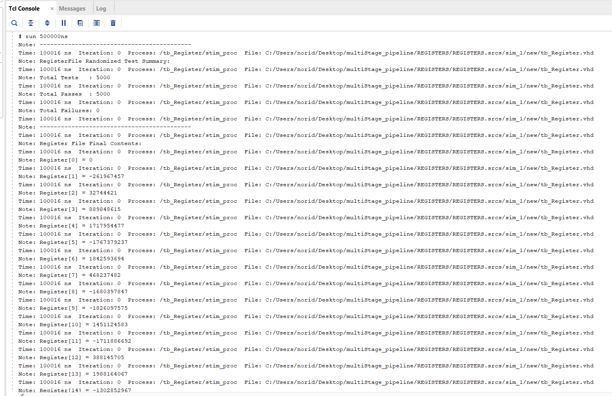

# 32x32-bit Register File in VHDL

## Overview
Designed and implemented a 32-register file (32-bit width each) in VHDL for a custom CPU. The module supports dual-read and single-write ports with synchronous write and asynchronous read operations. Register x0 is hardwired to zero, rejecting all write attempts per RISC-V convention. A synchronous reset clears all registers to zero. Verified functionality using a randomized testbench that dynamically generated write/read sequences, including edge cases like x0 write protection and reset behavior.

## Project Structure
32x32-bit-Register-File-in-VHDL/
- images/
    - REG_TCL_1.png
    - REG_TCL_2.png
    - reg_wave_1.png
    - reg_wave_2.png
    - reg_wave_3.png
    - reg_wave_4.png
    - reg_wave_5.png
- src/
    - Register_File.vhd
- test_bench/
    - tb_Register/
- .gitignore/
- README.md/

## Testbench Strategy
The register file was tested using a randomized VHDL testbench that simulates realistic and edge-case scenarios. The testbench performs the following:
- Generates random write addresses, data values, and control signals each cycle
- Randomly selects read addresses and compares output with expected results
- Ensures register x0 always reads as zero and ignores write attempts
- Verifies correct behavior after reset (all registers return to 0)
- Tracks write history to assert correctness of future read operations

By randomizing inputs and monitoring output correctness across many cycles, this strategy uncovers unexpected behavior and validates robustness beyond fixed test cases.

## Key Learnings
- Understood the importance of enforcing architectural constraints (e.g., hardwired x0 register like in RISC-V)
- Learned how to design and implement asynchronous read and synchronous write behavior
- Learned to safeguard hardware designs using randomized testbenches that auto-generate inputs and validate results to catch edge cases missed by manual tests
- Improved debugging skills using TCL scripts to control simulation runs and automate waveform inspection
- Reinforced knowledge of CPU register file operation

## Simulation Results
**5000/5000** randomized test cases passed
### Tcl Console Output

### Waveform Example

## How to Run

1. Launch **Vivado 2019** or newer
2. Open the project or create a new one and add the src and a test bench file.
3. Set the testbench file as the top-level simulation unit.
4. Run the simulation:
    - Go to Flow → Run Simulation → Run Behavioral Simulation
    - Or use the project manager's simulation shortcut.
5. View signals in the Waveform Viewer and test status in the Tcl Console.

## Author
**Noridel Herron** (@MIZZOU)  
Senior in Computer Engineering  
noridel.herron@gmail.com

## Contributing
This is a personal academic project. Suggestions, issues, and improvements are welcome through GitHub.

## License
MIT License

## Author
**Noridel Herron** (@MIZZOU)  
Senior in Computer Engineering  
noridel.herron@gmail.com

## Disclaimer
This project is developed solely for educational and personal learning purposes.  
It may contain unfinished or experimental features and is not intended for commercial or production use.
